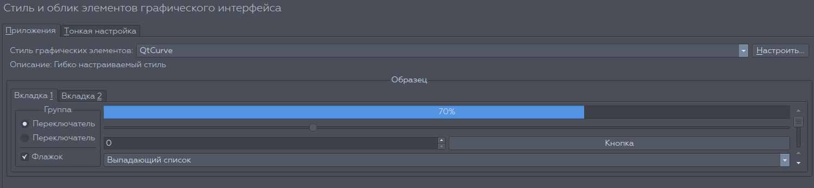

qtcurve-theme-neru
===============

Стиль QtCurve для темы QtCurve

## Изображение (может немного отличатся от оригинала)

## Особенности

* Голубая тема
* Зелёная тема

## Установка

Для KDE 5 Plasma `git clone https://github.com/chistota/qtcurve-theme-neru.git /usr/share/QtCurve`

Для KDE 4 `git clone https://github.com/chistota/qtcurve-theme-neru.git /usr/sharea/apps/QtCurve`

## Сообщество
РОСПО Дизайн-студия
https://vk.com/rospodesign
